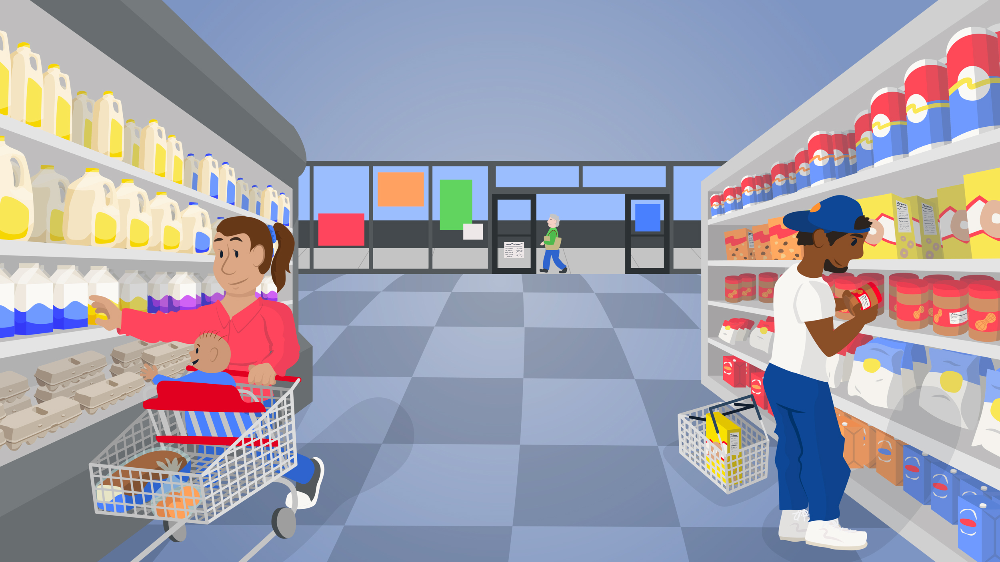
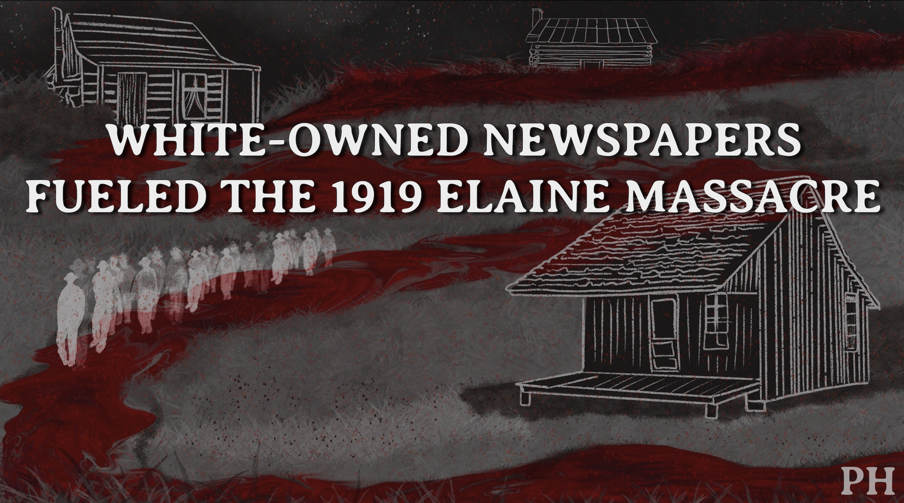
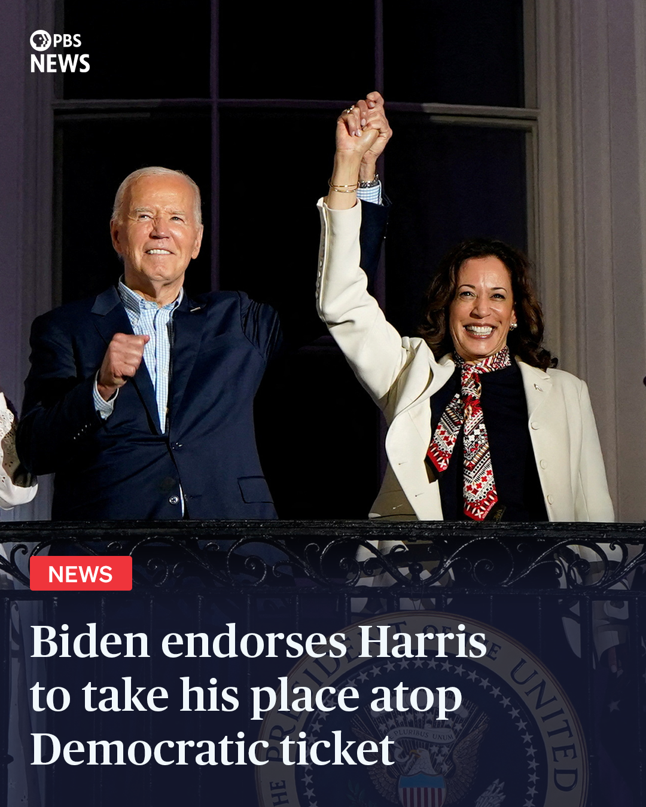

# Jenna Cohen - Work Samples

I’m Jenna Cohen, a visual journalist and storyteller experienced in using a variety of forms (graphics, animation, web design) to produce content that is engaging, digestible and accurate.

Below are work samples that demonstrate my passion for this work and the skills I have. For my full portfolio of published work, visit [jenna-cohen.com](https://jenna-cohen.com)

<a href="https://www.pbs.org/newshour/features/smart-shopping-quiz/"><kbd></kbd></a>

### [Quiz: Are You A Smart Shopper?](https://www.pbs.org/newshour/features/smart-shopping-quiz/)

As food prices have risen due to factors such as inflation, I worked with members of the PBS News digital and product team to design [desktop](https://www.figma.com/proto/YmvmeWg0NScrOaoy3c8n3G/Smart-shopping?type=design&node-id=261-3230&t=GKXNvlmaGNoJDwKU-0&scaling=min-zoom&starting-point-node-id=261%3A3230&show-proto-sidebar=1) and [mobile](https://www.figma.com/proto/YmvmeWg0NScrOaoy3c8n3G/Smart-shopping?type=design&node-id=1262-45166&t=GKXNvlmaGNoJDwKU-0&scaling=min-zoom&starting-point-node-id=1262%3A45166&show-proto-sidebar=1) UI prototypes for an interactive feature where users could watch and read to learn how to best shop on a budget, then take our quiz to test their skills. The interactive led our site for engagement time on a single page during the week following publication. It was also featured on our [broadcast program](https://www.youtube.com/watch?v=emErLPu0-O0&t=12s).

**My role:**

- Wireframing and prototyping: Figma
- Interface design and development: Figma, Illustrator, HTML, CSS, JavaScript
- Mobile & desktop design
- Sketching & illustration: Procreate, Illustrator
- Layout
- Typography
- Color Theory

<a href="https://www.youtube.com/watch?v=t5dwfbmb328"><kbd></kbd></a>

### [Elaine Massacre Mini Documentary](https://www.youtube.com/watch?v=t5dwfbmb328)

As an enterprise piece of the [Printing Hate](https://lynching.cnsmaryland.org/) investigation, the documentary explains the economic motives behind the Elaine Massacre and how white-owned newspapers fueled the violence. I combined archives, custom illustrations, interviews, data visualizations, and motion graphics to create this visual experience.

**My role:**

- Animation and video editing: After Effects, Premiere
- Mapping and data visualization: Carto, Datawrapper, Illustrator, Photoshop
- Illustration and design: Illustrator, Procreate
- Script development
- Project management

### [Breaking News Graphics](https://github.com/jennacohen/newshour/tree/main/design_graphics)

<a href="https://github.com/jennacohen/newshour/tree/main/design_graphics"><kbd></kbd></a>

I produce breaking news graphics on a regular basis for PBS News' website and social platforms. Examples include [Sen. Bob Menendez being found guilty of bribery](https://www.instagram.com/p/C9fd1ibpSbZ/), the [dismissal of the Trump classified documents case](https://www.instagram.com/p/C9cl4PpJ8JT/) and the statement made by the [U.N. Secretary-General on climate change](https://www.instagram.com/newshour/p/C72ghUDRUnz/).

**My role:**

- Graphic design: Illustrator, Photoshop, Figma
- Template design and management: Figma, Illustrator, OneDrive

<a href="https://lynching.cnsmaryland.org/"><kbd></kbd></a>

### [Printing Hate Investigation](https://lynching.cnsmaryland.org/)

Printing Hate is an investigation into how white-owned newspapers have aided and abetted lynchings since 1865. As a Digital and Graphics Designer, my team and I developed the site with the intention of telling the story the moment a user lands on the page, using a motion graphic embedded as a site topper to help achieve this goal. Our design also included several story page layouts and an interactive database.

**My role:**

- Branding development: Photoshop, Illustrator
- Prototyping: Figma, XD
- Interface design and development: HTML, CSS, GitHub, WordPress
- Animation and video editing: After Effects, Premiere

<a href="https://www.youtube.com/watch?v=uVTz3qN1KaM"><kbd></kbd></a>

### [New York’s illegal weed market](https://www.youtube.com/watch?v=uVTz3qN1KaM)

I produced original assets, graphics and animations to tell the story of New York’s illegal weed market visually. I led conversations on how to create a distinct visual experience that had unique typography and color while still communicating the information and data clearly and accurately. The piece was also posted as an [article](https://www.pbs.org/newshour/nation/weed-is-legal-in-new-york-but-the-illegal-market-is-still-booming-heres-why) with embedded video, quotes and graphics.

**My role:**

- Animation and video editing: After Effects, Premiere
- Mapping and data visualization: Datawrapper, Illustrator, Photoshop

<a href="https://www.pbs.org/newshour/nation/how-south-dakota-voters-could-help-save-the-lives-of-uninsured-moms"><kbd></kbd></a>

### [Here’s what the pregnant and uninsured face in South Dakota](https://www.pbs.org/newshour/nation/how-south-dakota-voters-could-help-save-the-lives-of-uninsured-moms)

In 2022, one out of 10 South Dakotans didn’t have health insurance, according to the Census Bureau. I worked alongside our health reporter to coordinate resources and gather data in South Dakota, visualized data in a static chart and interactive map, and customized the page layout in our CMS to highlight key quotes, photography, and side stories.

**My role:**

- Data reporting and analysis: Google Sheets
- Coordinating photographer based in South Dakota
- Information graphic design: Illustrator, Datawrapper
- Interface design: HTML, CSS, WordPress

<a href="https://www.youtube.com/watch?v=vEMIBglapVM"><kbd></kbd></a>

### [2024 Motion Showreel](https://www.youtube.com/watch?v=vEMIBglapVM)

One of my favortite forms of visual storytelling is animation and motion graphic design. My showreel highlights some of my favorite animations I've produced for PBS News, Howard Center for Investigative Journalism, CNS Maryland and more.

**My role:**

- Animation and video editing: After Effects, Premiere
- Data visualization: Datawrapper, Illustrator, Photoshop
